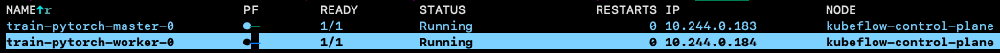

# End-to-End Machine Learning System with Kubeflow

This project demonstrates building an end-to-end machine learning system on Kubeflow, encompassing model training, deployment, and inference. It integrates a custom ML model application with official Kubeflow manifests for platform deployment.

## Core Features

-   **Model Training** (Kubeflow Trainier): Defines model architecture and outlines conceptual training flow.
-   **Model Inference** (Kubeflow KServe): Deploys trained models as API services.
-   **MLOps Platform** (Kubeflow Dashboard and Notebooks): Leverages Kubeflow for comprehensive ML lifecycle management.
-   **Reproducible Deployment** (InferenceServie with Knative): Provides complete Kubeflow configurations for consistent environment setup across Kubernetes clusters.


## Prerequisites

Before you begin, ensure the following environment is set up:

1.  A running Kubernetes cluster (e.g., Minikube, Kind, GKE, EKS, etc.).
2.  `kubectl` 
3.  `kustomize`

## Quick Start

### Step 0: Build Kind Cluster

If you don't have a Kubernetes cluster, you can quickly set one up using Kind.

```bash
# Create a Kind cluster named 'kubeflow' using the specified configuration file.
# This configuration file (kubeflow-example-config.yaml) should define cluster-specific settings.
kind create cluster --name=kubeflow  --config kubeflow-example-config.yaml
```

Save Kubeconfig:
```bash
kind get kubeconfig --name kubeflow > /tmp/kubeflow-config
export KUBECONFIG=/tmp/kubeflow-config
```

Create a Secret Based on Existing Credentials to Pull the Images:
```bash
docker login 

kubectl create secret generic regcred \
    --from-file=.dockerconfigjson=$HOME/.docker/config.json \
    --type=kubernetes.io/dockerconfigjson
```

### Step 1: Deploy Kubeflow Platform

The `manifests` directory contains all resources required to deploy Kubeflow. In this project, I disable Kubeflow Pipelines, Katib and Spark Operator due to limited resource.

> **Note**: Deploying a full Kubeflow instance is complex and may require environment-specific adjustments (e.g., storage, networking, authentication). The following command provides a basic deployment example.

```bash
# git clone the kubeflow/manifest repo
git clone https://github.com/kubeflow/manifests.git

# Change directory to the manifests folder
cd manifests

# Build Kubeflow configurations using kustomize and apply them to the Kubernetes cluster.
# This process downloads and creates numerous Kubernetes resources and may take some time.
while ! kustomize build example | kubectl apply --server-side --force-conflicts -f -; do echo "Retrying to apply resources"; sleep 20; done
```

After deployment, refer to the [Official Kubeflow Documentation](https://www.kubeflow.org/docs/started/getting-started/) to access your Kubeflow Dashboard.

``` bash
export ISTIO_NAMESPACE=istio-system
kubectl port-forward svc/istio-ingressgateway -n ${ISTIO_NAMESPACE} 8080:80
```


### Step 2: Model Training

DCNv2 (Deep & Cross Network v2) is a CTR/recommendation model that combines a deep network with explicit cross layers to efficiently capture both low- and high-order feature interactions. TaobaoAd_x1 is a large-scale display advertising dataset from the Taobao platform, with user, ad/item, and context features labeled for click-through prediction. In this project, we use a 1% sample of the training split for faster experimentation.

- Model: [DCNv2](https://arxiv.org/abs/2008.13535)
- Dataset: [TaobaoAd_x1](https://github.com/reczoo/Datasets/tree/main/Taobao/TaobaoAd_x1)

The `model_weights.pth` file contains pre-trained model weights. To retrain:

1. Use Central Board to initiate a notebook. (It will also create a PVC for you.)
2. Copy `train.ipynb`, `model.py` and `feature_encoder.py` to the workdir.
3. Refer to `train.ipynb` to explore distributed pytorch model trainig.
  


Pytorch DDP pods:



### Step 3: Define Custom Model

We will use `serve.py` to create and deploy an inference server to Kubernetes. This is a custom predictor implemented using KServe API.

> seems that KServe migrates TorchServe to Triton TorchScript backend recently... 

1.  **Package the Inference Service as a Docker Image**

    Pack the image with `Procfile`, `.python-version` and `pyproject.toml`.
    ```bash
    pack build --builder=heroku/builder:24 ${DOCKER_USER}/dcnv2:v1
    ```


2.  **Push the Image to Docker Hub**

    ```bash
    docker push ${DOCKER_USER}/dcnv2:v1
    ```


### Step 4: Deploy the Service in Kubernetes

Create a `serve.yaml` file to define the `InferenceService` CR.   Modify `image` and `STORAGE_URI` if needed.

```yaml
apiVersion: serving.kserve.io/v1beta1
kind: InferenceService
metadata:
  name: dcnv2
  namespace: kubeflow-user-example-com
  annotations:
    sidecar.istio.io/inject: "false"
spec:
  predictor:
    scaleTarget: 1
    scaleMetric: concurrency
    maxReplicas: 10
    containers:
      - name: kserve-container
        image: boboru/dcnv2:v1
        resources:
          requests:
            cpu: "100m"
            memory: "512Mi"
          limits:
            cpu: "1"
            memory: "1Gi"
        env:
          - name: PROTOCOL
            value: v2
          - name: MODEL_PATH
            value: /mnt/models/model_weights.pth
          - name: ENCODER_PATH
            value: /mnt/models/preprocess_metadata.pkl
          - name: DENSE_COLS
            value: price
          - name: SPARSE_COLS
            value: userid,cms_segid,cms_group_id,final_gender_code,age_level,pvalue_level,shopping_level,occupation,new_user_class_level,adgroup_id,cate_id,campaign_id,customer,brand,pid,btag
          - name: STORAGE_URI
            value: pvc://torch-workspace
```

Deploy it:
```bash
# Apply the Kubernetes manifest defined in serve.yaml to create the InferenceService
kubectl apply -f serve.yaml
```

### Step 4: Test Inference Service

#### Out-of-cluster
After deployment, test the service locally via `port-forward`.

1.  **Forward the Service Port to Local**

    ```bash
    # ignore it if the service has been forwarded
    export ISTIO_NAMESPACE=istio-system
    kubectl port-forward svc/istio-ingressgateway -n ${ISTIO_NAMESPACE} 8080:80
    ```

2.  **Send Inference Request**

  
    Because the model is deployed on Kubeflow, you need appropriate permissions. Use a ServiceAccount (SA) to obtain a JWT token to access the model. Adjust the `--duration` value as needed. For details, see the [KServe Istio + Dex sample](https://github.com/KServe/KServe/tree/master/docs/samples/istio-dex).

    ```bash
    INGRESS_HOST=localhost
    INGRESS_PORT=8080
    MODEL_NAME=dcnv2
    INPUT_PATH=./input.json

    SERVICE_HOSTNAME=$(kubectl get inferenceservice -n kubeflow-user-example-com $MODEL_NAME -o jsonpath='{.status.url}' | cut -d "/" -f 3)

    TOKEN=$(kubectl create token default-editor -n kubeflow-user-example-com --audience=istio-ingressgateway.istio-system.svc.cluster.local --duration=24h)
    ```
      
    Use curl to send infer request (v1):

    ```bash
    curl -v -H "Host: $SERVICE_HOSTNAME" -H "Content-Type: application/json" -H "Authorization: Bearer $TOKEN" -d @$INPUT_PATH http://${INGRESS_HOST}:${INGRESS_PORT}/v1/models/$MODEL_NAME:predict 
    ```

    Furthermore, `test_infer.py` demonstrates the code for sending request directly or adopting `InferenceRESTClient` from KServe:

    ```bash
    uv run test_infer.py --token $TOKEN --host $SERVICE_HOSTNAME
    ```

#### In-cluster
Since we are in the cluster, the JWT token can be ignored. Also, internval service endpoint can be accessed directly. 

Visit `inference.ipynb` and excute it in the cluster for more exmaples.
    
### Step 5 (Optional): Autoscaling

With the Knative Pod Autoscaler configured in `serve.yaml`, you can load test the service using [hey](https://github.com/rakyll/hey).

```yaml
  scaleTarget: 1
  scaleMetric: concurrency
  maxReplicas: 10
```

Load test with `hey`:
``` bash
hey -z 30s -c 30 -m POST -host ${SERVICE_HOSTNAME}  -H "Content-Type: application/json" -H "Authorization: Bearer $TOKEN" -D $INPUT_PATH http://${INGRESS_HOST}:${INGRESS_PORT}/v1/models/$MODEL_NAME:predict
```

The number of InferenceService pods will scale up until it reaches `maxReplicas`.
